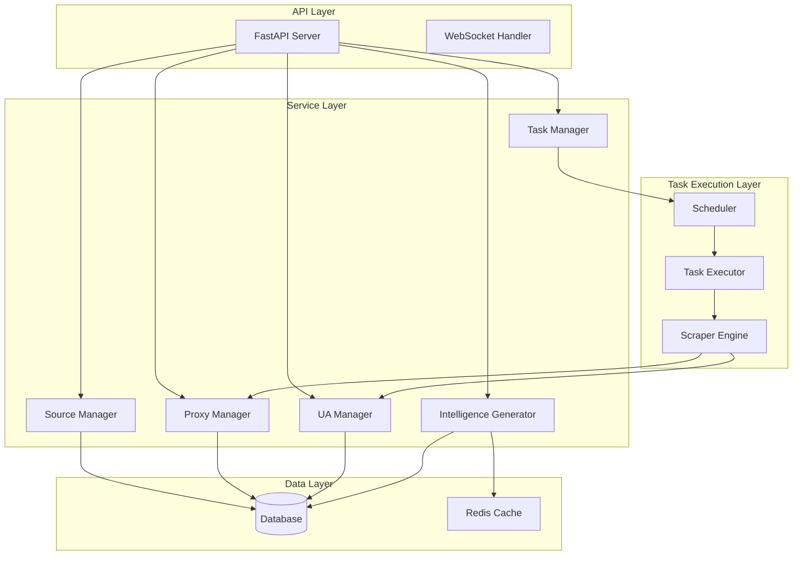
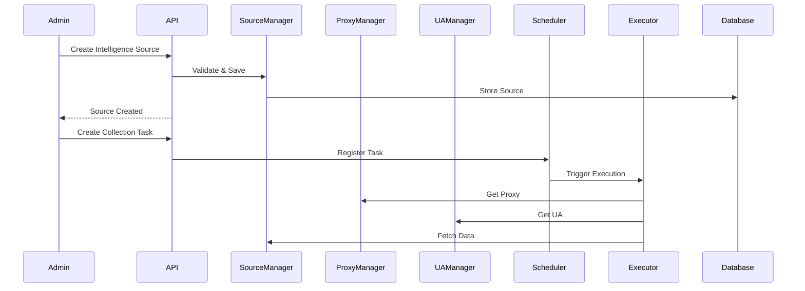

# Business Intelligence System - Technical Design Specification

Feature Name: business-intelligence-system
Updated: 2026-03-19

## Description

业务情报系统是一个模块化的情报采集与管理平台。系统采用Python开发，基于FastAPI构建Web服务，使用SQLite/PostgreSQL作为数据存储，支持分布式代理采集和自动化任务调度。

## Architecture

### System Architecture Diagram



### Component Interaction Diagram



## Components and Interfaces

### 1. SourceManager (情报源管理器)

**职责**: 管理情报源的增删改查，支持启用/禁用控制

**接口**:

| Method | Endpoint | Description |
|--------|----------|-------------|
| POST | /api/v1/sources | 创建情报源 |
| GET | /api/v1/sources | 获取情报源列表 |
| GET | /api/v1/sources/{id} | 获取情报源详情 |
| PUT | /api/v1/sources/{id} | 更新情报源 |
| DELETE | /api/v1/sources/{id} | 删除情报源 |
| POST | /api/v1/sources/{id}/enable | 启用情报源 |
| POST | /api/v1/sources/{id}/disable | 禁用情报源 |

**数据模型**:

```python
class IntelligenceSource(BaseModel):
    id: str
    name: str
    url: str
    source_type: SourceType  # website, api, rss
   采集周期: int  # minutes
    enabled: bool
    headers: dict
    cookies: dict
    created_at: datetime
    updated_at: datetime
```

### 2. ProxyManager (代理池管理器)

**职责**: 管理代理IP池，支持代理测试和自动禁用

**接口**:

| Method | Endpoint | Description |
|--------|----------|-------------|
| POST | /api/v1/proxies | 添加代理 |
| GET | /api/v1/proxies | 获取代理列表 |
| POST | /api/v1/proxies/{id}/test | 测试代理可用性 |
| DELETE | /api/v1/proxies/{id} | 删除代理 |
| GET | /api/v1/proxies/available | 获取可用代理 |

**数据模型**:

```python
class Proxy(BaseModel):
    id: str
    ip: str
    port: int
    protocol: Protocol  # http, https, socks5
    username: Optional[str]
    password: Optional[str]
    quality_score: float  # 0.0 - 1.0
    failure_count: int
    enabled: bool
    last_tested_at: datetime
    created_at: datetime
```

### 3. UAManager (UA池管理器)

**职责**: 管理User-Agent字符串池，支持随机选取

**接口**:

| Method | Endpoint | Description |
|--------|----------|-------------|
| POST | /api/v1/user-agents | 添加UA |
| GET | /api/v1/user-agents | 获取UA列表 |
| DELETE | /api/v1/user-agents/{id} | 删除UA |
| POST | /api/v1/user-agents/random | 获取随机UA |

**数据模型**:

```python
class UserAgent(BaseModel):
    id: str
    ua_string: str
    browser: str
    os: str
    enabled: bool
    created_at: datetime
```

### 4. TaskManager (任务管理器)

**职责**: 管理采集任务的创建、调度、执行控制

**接口**:

| Method | Endpoint | Description |
|--------|----------|-------------|
| POST | /api/v1/tasks | 创建任务 |
| GET | /api/v1/tasks | 获取任务列表 |
| GET | /api/v1/tasks/{id} | 获取任务详情 |
| POST | /api/v1/tasks/{id}/pause | 暂停任务 |
| POST | /api/v1/tasks/{id}/resume | 恢复任务 |
| POST | /api/v1/tasks/{id}/cancel | 取消任务 |
| GET | /api/v1/tasks/{id}/logs | 获取任务日志 |

**数据模型**:

```python
class CollectionTask(BaseModel):
    id: str
    name: str
    source_ids: List[str]
    proxy_enabled: bool
    ua_enabled: bool
    cron_expression: str
    timeout: int  # seconds
    retry_count: int
    status: TaskStatus  # pending, running, paused, cancelled, completed
    created_at: datetime
    updated_at: datetime
```

### 5. IntelligenceGenerator (情报生成器)

**职责**: 处理原始数据，生成结构化情报详情

**接口**:

| Method | Endpoint | Description |
|--------|----------|-------------|
| GET | /api/v1/intelligence | 查询情报列表 |
| GET | /api/v1/intelligence/{id} | 获取情报详情 |
| GET | /api/v1/intelligence/search | 搜索情报 |
| DELETE | /api/v1/intelligence/{id} | 删除情报 |

**数据模型**:

```python
class IntelligenceDetail(BaseModel):
    id: str
    source_id: str
    title: str
    content: str
    summary: str
    keywords: List[str]
    entities: List[dict]  # 实体信息
    raw_data: dict
    collected_at: datetime
    processed_at: datetime
    deduplication_key: str
```

## Data Models

### Database Schema (SQLAlchemy)

```python
# models/source.py
class IntelligenceSourceModel(Base):
    __tablename__ = "intelligence_sources"
    id = Column(String(36), primary_key=True)
    name = Column(String(200), nullable=False)
    url = Column(String(2000), nullable=False)
    source_type = Column(String(50), nullable=False)
   采集周期 = Column(Integer, default=60)
    enabled = Column(Boolean, default=False)
    headers = Column(JSON)
    cookies = Column(JSON)
    created_at = Column(DateTime, default=datetime.utcnow)
    updated_at = Column(DateTime, default=datetime.utcnow, onupdate=datetime.utcnow)

# models/proxy.py
class ProxyModel(Base):
    __tablename__ = "proxies"
    id = Column(String(36), primary_key=True)
    ip = Column(String(50), nullable=False)
    port = Column(Integer, nullable=False)
    protocol = Column(String(20), default="http")
    username = Column(String(100))
    password = Column(String(100))
    quality_score = Column(Float, default=1.0)
    failure_count = Column(Integer, default=0)
    enabled = Column(Boolean, default=True)
    last_tested_at = Column(DateTime)
    created_at = Column(DateTime, default=datetime.utcnow)

# models/user_agent.py
class UserAgentModel(Base):
    __tablename__ = "user_agents"
    id = Column(String(36), primary_key=True)
    ua_string = Column(String(500), nullable=False)
    browser = Column(String(100))
    os = Column(String(100))
    enabled = Column(Boolean, default=True)
    created_at = Column(DateTime, default=datetime.utcnow)

# models/task.py
class CollectionTaskModel(Base):
    __tablename__ = "collection_tasks"
    id = Column(String(36), primary_key=True)
    name = Column(String(200), nullable=False)
    source_ids = Column(JSON)
    proxy_enabled = Column(Boolean, default=True)
    ua_enabled = Column(Boolean, default=True)
    cron_expression = Column(String(100))
    timeout = Column(Integer, default=300)
    retry_count = Column(Integer, default=3)
    status = Column(String(50), default="pending")
    created_at = Column(DateTime, default=datetime.utcnow)
    updated_at = Column(DateTime, default=datetime.utcnow, onupdate=datetime.utcnow)

# models/intelligence.py
class IntelligenceDetailModel(Base):
    __tablename__ = "intelligence_details"
    id = Column(String(36), primary_key=True)
    source_id = Column(String(36), ForeignKey("intelligence_sources.id"))
    title = Column(String(500))
    content = Column(Text)
    summary = Column(Text)
    keywords = Column(JSON)
    entities = Column(JSON)
    raw_data = Column(JSON)
    collected_at = Column(DateTime)
    processed_at = Column(DateTime, default=datetime.utcnow)
    deduplication_key = Column(String(200))
```

## Correctness Properties

### Invariants

1. **代理池可用性**: 任意时刻可用代理数量 >= 0
2. **任务状态合法性**: 任务状态转换必须符合状态机规则
3. **情报去重**: 相同deduplication_key的情报最多存在一条
4. **资源隔离**: 同一任务不会同时在多个执行器运行

### Constraints

1. 代理池最小配置: 至少配置1个可用代理
2. UA池最小配置: 至少配置1个可用UA
3. 情报源URL最大长度: 2000字符
4. 任务超时最大值: 3600秒(1小时)

## Error Handling

### Error Codes

| Code | Name | Description |
|------|------|-------------|
| 1001 | SOURCE_NOT_FOUND | 情报源不存在 |
| 1002 | SOURCE_INVALID_URL | 情报源URL格式无效 |
| 2001 | PROXY_UNAVAILABLE | 代理不可用 |
| 2002 | PROXY_TEST_FAILED | 代理测试失败 |
| 3001 | TASK_NOT_FOUND | 任务不存在 |
| 3002 | TASK_TIMEOUT | 任务执行超时 |
| 3003 | TASK_CONFLICT | 任务冲突 |
| 4001 | INTELLIGENCE_NOT_FOUND | 情报不存在 |
| 5001 | DATABASE_ERROR | 数据库错误 |
| 5002 | CACHE_ERROR | 缓存错误 |

### Error Response Format

```json
{
    "error": {
        "code": 1001,
        "message": "情报源不存在",
        "details": {
            "source_id": "xxx"
        }
    }
}
```

## Test Strategy

### Unit Tests

- SourceManager: 测试CRUD操作和业务逻辑
- ProxyManager: 测试代理验证和评分逻辑
- UAManager: 测试UA随机选取
- IntelligenceGenerator: 测试数据处理和去重

### Integration Tests

- API端到端测试
- 任务调度流程测试
- 代理轮询分配测试

### Test Coverage Target

- 核心业务逻辑覆盖率 >= 80%
- API端点覆盖率 >= 90%
